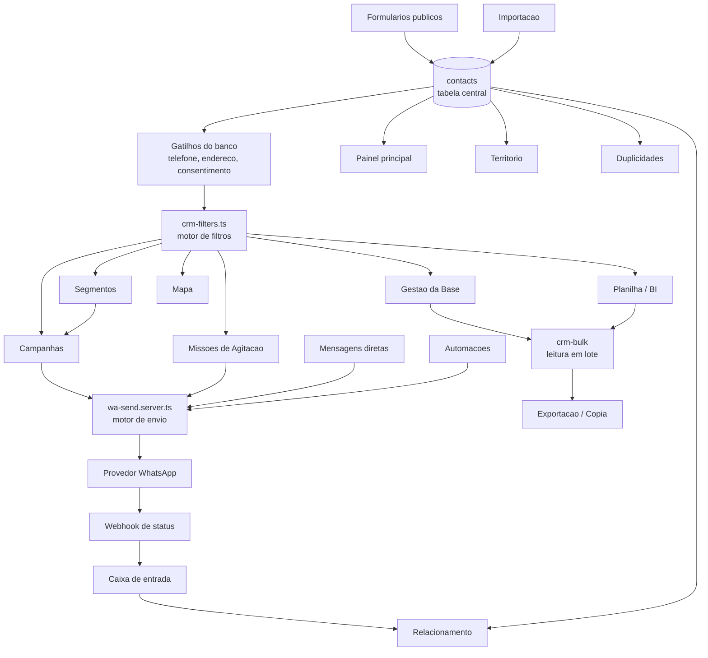

# 06 — Mapa de Dependências entre Módulos

> Auditoria conceitual — Entrega 2. Mostra o que quebra quando algo muda.

## 1. Grafo de dependências



## 2. Pontos de concentração de risco

| Nó | Quantos módulos dependem | Se mudar sem cuidado |
| --- | --- | --- |
| `contacts` + gatilhos | todos | efeito global; mudar a normalização de telefone reclassifica 3.270 registros |
| `crm-filters.ts` | 6 módulos + 8 componentes | uma alteração no motor muda CRM, BI, mapa, segmentos, campanhas e missões ao mesmo tempo |
| `wa-send.server.ts` | campanhas, missões, mensagens diretas, automações, respostas automáticas | toda comunicação sai por aqui |
| `crm-bulk` | exportação, cópia, ações em massa | falhas silenciosas se não for usado |
| Webhook do provedor | status de envio, caixa de entrada, relacionamento | se parar, os números de entrega congelam sem aviso |

**Leitura importante:** essa concentração é **um ponto forte, não um defeito**.
Existirem apenas dois grandes funis (filtros e envio) é o que torna a
centralização proposta na Entrega 2 viável com esforço baixo. O problema atual
é que os módulos passam pelos funis **e ainda assim reescrevem parte da regra
depois**.

## 3. Matriz de impacto — o que mexe em quê

| Se eu alterar… | Impacto direto | Impacto indireto (fácil de esquecer) |
| --- | --- | --- |
| Padrão de arquivados no motor de filtros | CRM, BI, mapa | contagem de segmento, audiência de campanha, criação de missão, exportação |
| Definição de "tem telefone" | tabela, filtro | missões (contatos ignorados), campanhas (aptos), chip de revisão |
| Regra de "apto a receber" | prévia de campanha | disparo real, missões, automações, mensagens diretas |
| Normalização de telefone (gatilho) | phone_status de toda a base | chips, filtros, missões, campanhas, duplicidades |
| Campos varridos pela busca | CRM | território, agitação, caixa de entrada (têm busca própria) |
| Status de campanha | tela de campanhas | webhook, relacionamento, pausa por shadowban |
| Marcar contato como usuário do sistema | usuários | contagem da base, audiência, missões |

## 4. Dependências ocultas (as que mais causam regressão)

1. **Segmento → Campanha.** Alterar o filtro de um segmento muda,
   retroativamente, o público de qualquer campanha em rascunho ligada a ele.
   Não há aviso na interface.
2. **Gatilho de telefone → Chips e filtros.** Os rótulos da interface foram
   escritos à mão a partir do tipo do banco, não do que o gatilho realmente
   grava — daí o `sem DDD` que nunca traz nada.
3. **Webhook → Relacionamento.** Os indicadores de entrega dependem inteiramente
   de o provedor chamar de volta. Não existe reconciliação; se o webhook falhar,
   os números simplesmente param no tempo, sem indicação de defasagem.
4. **Missão → Contato.** Missões guardam a lista de contatos no momento da
   criação. Arquivar um contato depois **não o retira** das missões já
   distribuídas.
5. **Importação → Duplicidades.** Cada importação dispara detecção de duplicados
   por gatilho; um lote grande pode gerar pares que ninguém revisa (a fila de
   duplicidades não é notificada).

## 5. Ordem segura de intervenção

Derivada do grafo — cada passo depende só do anterior:

```text
1. crm-bulk / leitura em lote      (isolado, risco zero, corrige truncamento)
2. tem telefone / telefone preferido (usado por 3, não altera consulta)
3. contato ativo (padrão de arquivado dentro do motor)  ← muda números na tela
4. apto a receber (funil de envio)  ← depende de 2 e 3
5. busca textual unificada
6. indicadores dos painéis          ← depende de 3 e 4
7. usuário do sistema               ← depende de decisão de produto
```

Fazer na ordem inversa (começar pelos painéis) é o que garante retrabalho: os
números seriam corrigidos por fora e voltariam a divergir na primeira tela nova.

## 6. Resumo da Entrega 2

- **4 indicadores estruturalmente errados**, todos por regra duplicada.
- **8 regras de negócio com implementações concorrentes**, todas com uma
  referência natural já existente no código.
- **8 de 8 resolvíveis apenas centralizando**, sem tocar no modelo de dados e
  sem redesenhar interface.
- Duas exigem uma decisão de produto antes: o que é "apoiador" e se arquivado
  entra no total.

A Entrega 3 (`00-referencias-open-source.md`, `07-experiencia-uso.md`,
`08-relatorio-final.md`) fecha com o comparativo conceitual dos projetos de
referência e o plano priorizado.
